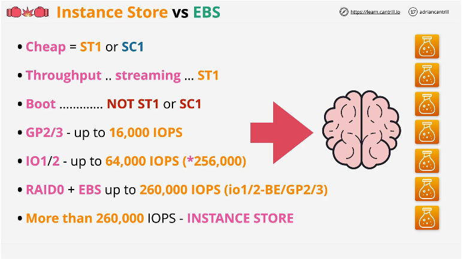

# AWS Solution Architect Associate
  
  Notes taken during learn.cantril.io SAA Course

## Key Management Server `KMS`

- `KMS` is a Regional & Public service
  - Every region is isolated when using `KMS` (Separate product in each region)
- Lets you create, store and manage cryptographic keys
  - Handles both Symmetric and Asymmetric keys
  - Capable of performing cryptographic operations (Encryption & Decryption)
- Keys are locked inside of KMS  (They will never leave it) and are securely stored
  - KMS is FIPS 140-2(L2) Certified
- The primary thing KMS manages are Customer Master Key `CMK`
  - These are logical (container for the physical master key)
    - Contains : Key ID, Creation Date, Key Policy (Resource Policy), Description, State (Enabled Disabled)
    - Every CMK is backed by a physical key material, this data is held by KMS and is used to encrypt & decrypt
      - This can be generated by `KMS` or imported if you have an existing one
    - CMKs can only be used to directly encrypt or decrypt data up to 4KB in size
- Data Encryption Keys `DEKs`
  - Data Encryption Key Work flow :
    1. Key is generated and you get two versions of the key
       - Plaintext
       - Cipher text (Encrypted) version of they
         - This is encrypted by the customer master key so it can decrypted by KMS
    2. Data is encrypted using the plaintext version of the key
    3. Discard the plain text version of the key
    4. Store encrypted key with the data
    5. When the data has to be decrypted, you give the encrypted key to KMS to decrypt it using the Customer Master key`
  - These can be generated in KMS and are generated using the Customer Master Key
    - These can be used to decrypt and encrypt data larger that 4KB
  - These are not stored by `KMS` it provides the key to you (or the service using it) then it is discarded
    - This is done because `KMS` does not do the encryption of the data instead you or the service does it
    - **KMS DOES NOT USE THE DATA ENCRYPTION KEY IT ONLY PROVIDES IT**

## Simple Storage Service (S3)

### Object Versioning

This is controlled at the bucket level and is disabled by default, once it is enabled it can never be disabled but can be suspended and reenabled.

- Space is consumed by all versions of the object
- If you turn on versioning on a bucket with a 5GB  file and you have 5 versions you are paying 5GB x 5 for storage

Versioning allows you to store multiple version of an object in a bucket, operations that modify objects generate a new version.

When versioning is disabled the object in the bucket is identified by its key and value, and the id of the object is set to null. Once you enable versioning the ID is changed when the object is modified

- These objects can be referenced by their version id to interact directly or omit this to reference the latest version of an object

- Objects do not get deleted  instead object deletion markers are put in place to  hide the objects.

- The delete marker is a special version of an object that hides all previous version of that object
- The delete marker can be deleted which essentially un-deletes the object.
- Versions of an object can be fully deleted, to do this delete a object and specify the ID of what you want to use.

### MFA Delete

MFA Delete is enabled in the versioning configuration and when it is enabled MFA is required to change bucket versioning state or to delete versions.

- When using MFA Delete with a API call you need to concatenate  the serial number of your MFA  token and the code it generates

### S3 Performance Optimization

By default when you upload a file to S3 it is uploaded as a single blob of data in a single stream

### Single PUT upload

- The file becomes an object and uses the PutObject API call to upload the file the bucket
  - If the stream fails the upload fails and you need to fully restart the upload
  - Speed & Reliability is limited because it is only using one stream of data
  - A single PUT upload is limited to Gb/s

### Multipart Upload

- Multipart upload is when the data is broken up into smaller parts
  - The minimum data size for multipart is 100MB
  - Almost always worth it to use multipart if the file is above 100MB
  - Can be split into a maximum of 10,000 parts 5MB > 5GV
    - The last part can be smaller than 5MB
  - In multipart each part can fail and be restarted instead of the entire upload being restarted

### S3 Transfer Acceleration

This is disabled by default, but when it is enabled S3 uses AWS edge location.

- When data is uploaded to S3 instead of it going directly to the S3 Bucket taking the public internet it instead goes directly to the closest and best performing AWS edge location, this data then travels the AWS Global network which is directly controlled by AWS
  - Goes over fewer "Normal Networks" which slow it down as AWS cant control all ISP networks.
  - The benefits achieved using Transfer Acceleration improve with the father away the uploader is from the S3 Bucket

### S3 Object Storage Classes

- **S3 Standard**
  - This is the default storage class when using S3
  - Should be used for `frequently` accessed data which is `important and non replaceable`
  - Objects are replicated across at least 3 availability zones
  - Provides 11 9's of durability (Lose one object every 10,000 years)
  - Billed GB/Month fee for data stored a $ per GB charge for transfer OUT (IN is free) and a price per 100 requests
    - No specific fee, no minimum duration, no minimum size
- **S3 Standard Infrequent Access** `S3 Standard-IA`
  - Should be used for `long-lived data` which is `important` but `access is infrequent`
  - Objects are replicated across at least 3 availability zones
  - Provides 11 9's of durability (Lose one object every 10,000 years)
  - Pricing model is the same as S3 Standard however it is much cheaper
    - There is now a retrieval fee (Per GB transferred out)
    - Has a minimum duration charge of 30 days and minimum capacity charge of 128KB per object
- **S3 One Zone Infrequent Access** `S3 One Zone-IA`
  - Should be used for `long lived data` which is `non-critical and replaceable` which is accessed `infrequently`  
  - Data stored here is only stored in one availability zone in the region (There is no replication)
  - Cheaper than S3 Standard & S3 Standard-IA
  - Pricing model is the same as S3 Standard however it is much cheaper
    - There is now a retrieval fee (Per GB transferred out)
    - Has a minimum duration charge of 30 days and minimum capacity charge of 128KB per object
- **S3 Glacier**
  - Should be used for `archival data` where `frequent or realtime access is not needed`
  - Replicated across 3 availability zones
  - Provides 11 9's of durability
  - Storage cost that is about 1/5th of S3 Standard
    - Objects in S3 Glacier cannot be made publicly accessible
    - If you want to retrieve an object from Glacier you must initiate a retrieval process (This is something you pay for)
      - Expedited - Data is accessible in 1-5 minutes
      - Standard Data is accessible in 3-5 hours
      - Bulk data is available in 5-12 hours
  - 40KB minimum billable size, 90 day minimum duration charge
  - First byte latency of minutes or hours
- **S3 Glacier Deep Archive**
  - `Archival data` that `rarely if ever needs to be accessed` - hours or days for retrieval
  Replicated across 3 availability zones
  - Provides 11 9's of durability
  - Approx. 1/4 the price of glacier
    - 40KB minimum billable size, 180 days minimum billable duration
  - If you want to retrieve an object from Glacier Archive you must initiate a retrieval process (This is something you pay for)
    - Standard Data is accessible in 12 hours
    - Bulk data is available in up to 48 hours
- **S3 Intelligent-Tiering**
  - Should be used for `long-living data` with `changing` or `unknown` patterns
  - This is a storage class that contains 4 different tiers of storage
    - Frequent Access Tier (S3 Standard)
    - Infrequent Access Tier (S3 Standard-IA)
    - Archive (Glacial)
    - Deep Archive (Glacial Archive)
  - The object is monitored and is moved between tiers as the usage goes up or down
    - Moves any object not accessed for 30 days to `infrequent access` and eventually to `archive` or `deep archive`
    - As objects are accessed they are moved back to the `frequent access` tier, there are no retrieval fees for accessing objects only a 30 day minimum duration

### S3 Select and Glacier Select

- S3 and Glacier select allow you to use a SQL-Like statement to retrieve partial objects from S3 and Glacier
  - You create a cut down SQL statement and send it to the select service, this statement is then used to select part of the object and it is then sent to the client in a pre-filtered way
  - Allows you to operate on many file formats :
    - CSV, JSON, Parquet, BZIP2 Compression for CSV and JSON files

- If you have an app in-taking all the objects in an S3 bucket then filtering on the app side:
  - S3 filtering occurs in-app which retrieves all the objects in a bucket all of which you are billed for
- if you have an app in-taking data but it is being filtered through S3 select:
  - SQL-like expression provided to S3 select only the selected files are transferred and billed  
  - Increase speed the data is received as fewer objects are transferred

### S3 Life Cycle Configuration

- Life cycle rules allows you to automatically transition or expire objects in a bucket
  - Allows you to optimize cost for larger S3 Buckets
- Life Cycle configurations are a set of rules you apply to a bucket or groups of objects
  - These rules consist of actions (If X do Y)
    - **Transition Actions** : Change the affected objects storage class (Transition S3 Standard > Glacier)
      - Smaller objects can cost more (Some storage classes have minimum size)
      - An object needs to stay on S3 Standard for 30 days before transitioning to either of the infrequent access tiers
    - Expiration Actions : Delete the affected objects (Object older than 120 days > Delete)

### S3 Replication

- S3 Allows you to configure the replication of objects between a SOURCE and DESTINATIOn bucket in the same or different AWS Account
- There are two types of replication :
  - **Cross Region Replication** `CRR`
    - Allows the replication between a SOURCE and DESTINATION across different AWS Regions
  - **Same Region Replication** `SRR`
    - Allows the replication between a SOURCE and DESTINATION across the same AWS region
- A **Replication Configuration** is applied to the source bucket this configures S3 to replicate from the source bucket to the destination bucket
  - It also defines logically the destination bucket to use
  - IAM Role to use for the replication process
    - This role is configured to allow the S3 bucket to assume it (Defined in its trust policy)
    - Gives it permission to read objects in the source and replicate those objects to the destination
    - When replicating across different AWS accounts this role is not trusted by the destination account by default, you will need to add a bucket policy to the destination bucket allowing the role to replicate to that bucket.
- S3 Additional Replication Options
  - Replicate all objects in a bucket or just a subset
    - The subset is defined by a filter of some sort
  - What storage class to replicate to
    - The default is to maintain the same storage class
  - Ownership of the object
    - The default is the source account
  - Replication Time Control `RTC`
    - Adds a guaranteed 15 minute replication SLA on this process
    - Without replication is a best effort process
  - Replication Metrics and Notifications
    - Monitor the progress of your replication rule through Cloud-watch Metrics
  - Delete Marker Replication
    - Delete markers created by S3 delete operations will be replicated (Deletions in the source are replicated to the destination)
- S3 Replication Considerations
  - `Not retroactive` & Versioning needs to be `enabled`
    - If you enable replication on a bucket that already has objects the old objects `will not` be replicated
  - `One way replication process` Source > Destination (Not bidirectional)
  - You are able to duplicate un-encrypted objects, objects encrypted with SSE-S3 & SSE-KMS(with extra config)
    - Cannot replicate objects encrypted with SSE-C as S3 does not have the keys used to access the plain text version of the object
  - Source bucket owner needs permissions to the objects that are replicating
  - does not replicate `System Events`, `Glacier` or `Glacier Deep Archive` storage classes
  - Deletes are not replicated
- Why use Replication
  - **Same Region Replication** `SRR`
    -Log Aggregation (Multiple S3 Buckets that receive logs replicate to one central bucket)
    - PROD to TEST Sync
    - Resilience with strict sovereignty requirements
  - **Cross Region Replication** `CRR`
    - Global Resilience Improvements
    - Latency Reduction

### S3 Pre-signed URLs

Pre-Signed URL's are a feature of S3 which allows you to provide another person or application access to an object inside an S3 bucket using your credentials in a safe and secure way.

- How are pre-signed URL's created :
  - a user with access rights to a S3 Bucket sends a request to S3 to generate a pre-signed URL when they make this request the user has to provide the following :
    - Security credentials
    - Bucket Name & Object Key
    - Expiry date and time
    - How to object will be accessed (PUT/GET Operation)
- Once the URL is used the holder is interacting with the object in the bucket as the user who generated it
- You can create a pre-signed URL for an object you have no access too
- When using a pre-signed URL it matches the permissions of the identity that generated it at the point you use it
  - If you get an access denied error when using a pre-signed URL the generating ID could had never had access or does not now
- **Do not** generate a pre-signed URL with a role ; URL stops working when temporary credentials expire you should always use long term identities

### S3 Events Notifications

This is a feature that allows you receive notifications when certain events happen in your bucket.

- Notifications can be delivered to :
  - `SNS` topics, `SQS` queues and Lambda functions
- S3 can alert on various events
  - Object creation (`PUT`,`POST`,`COPY`,Completed Multi Part Uploads)
  - Object Deletion (Delete,DeleteMarkerCreated)
  - Object Restore for objects in Glacier or Glacier Deep Archive (When a restore is started or when it is completed)
  - Object Replication (OperationMissedThreshold, Replication start/fail,etc.)

### S3 Access Logs

- A feature in S3 that provides detailed records for the requests that are made to a bucket
  - Log files consist of `log records` records are `newline-delimited`
    - These records contain `attributes` which contains things such as date/time,the requester, the operation,etc. (these are `space delimited`)

## Virtual Private Cloud (VPC)

### VPC Sizing and Structure

- VPC Considerations
  - What size should the VPC be
    - Minimum size of `/28`(16 IPs), Maximum size of `/16` (65456 IPs)
  - Are there any networks we cannot use
    - Do not overlap / duplicate IP ranges
    - Avoid common ranges to avoid future issues
  - VPC's,Cloud, On-Premises, Partners & Vendors
    - Avoid ranges other parties use (that you think you would interact with)
  - Try to predict the future
  - VPC Structure - Tiers & Resiliency (Availability) Zones
    - Subnets are available in 1 availability zone
  - You can optionally assign a IPv6 by using a `/56 CIDR` block
    - Either AWS will provide the range to you, or you can use an IPv6 range that you own

### Custom VPCs & VPC Theory

- VPCs are regionally isolated and regionally resilient service
  - It is created in a region and operates from all AZs in that region
- Allows you to create isolated networks inside AWS
  - Even in a single region in an account you can have multiple isolated networks
- Nothing is allowed IN or OUT without explicit configuration
- Flexible configuration Simple or Multi-tier
- Hybrid networking
  - Allows you to connect  your network to other cloud providers or to your on-premise networks
- `Default` or `Dedicated Tenancy`
  - Controls weather the services provisioned inside of an VPC are provisioned on shared hardware or dedicated hardware
  - `Default` :
    - Allows you to choose on a per-resource when you provision resources
  - `Dedicated Tenancy` :
    - Any resource created within the VPC HAVE to be on dedicated hardware
- VPCs have a fully featured DNS provided by Route 53
  - its available on the VPC `Base IP +2` address
    - If you have a base IP of `10.0.0.0` the DNS IP would be `10.0.0.2`
    - Has two important settings :
      - `EnableDnsHostnames` - gives instances DNS Names
        - Defines if instances with a public IP are given public DNS names
      - `EnableDnsSupport` - enables DNS resolution in VPC
        - If enabled instances instances in the VPC use DNS resolution

### VPC Subnets
  
- What is a subnet
  - AZ resilient feature of a VPC
  - A sub-network of a VPC - Created within 1 AZ and cannot be changed
    - 1 subnet is in 1 AZ, and a subnet can never be in more than 1 AZ  
    - if the AZ fails so does the subnet and services hosted in the subnet
  - The IPv4 CIDR is a subset of the VPC CIDR
    - Cannot overlap with other subnets
  - Can optionally be given a IPv6 CIDR if its enabled on the VPC `/64` subset of the `/56` VPC (256 /65 Subsets)
  - Subnets can communicate with other subnets in the VPC
- Reserved subnet IP Addresses
  - There are 5 reserved IP Addresses in every subnet
    - `Network` Address - First address in the network
    - `Network +1` Address - VPC Router (Logical Address that moves data between subnets and in/out the VPC)
    - `Network +2` Address - This is used for DNS
    - `Network +3` Address - Reserved for future use
    - `Broadcast` Address - Last IP in the subnet
- DHCP Option Sets
  - 1 DHCP Option set is applied to 1 VPC at a time, this flows to subnets
    - This controls things like DNS,NTP,NetBio,etc.
    - DHCP option sets can be created but not edited
      - If you want to change a setting you need to create a new one then change the VPC allocation to the new one
- 2 Important subnet options
  - These are both set at the subnet level
    - Auto assign public IPv4 addresses
    - Auto assign IPv6 addresses

### VPC Routing and Internet Gateway

#### VPC Router

- A highly available device that is present in every VPC
  - Has a network interface in every subnet in your VPC (Network +1)
  - By Default it only routes traffic between subnets in a VPC
- Route Tables
  - Controls what happens to data when it leaves the subnet its associated with
  - You can either have the main route table of the VPC (Default) or a custom one you have created
  - Route tables are attached to 0 or more subnets
  - A subnet must have a route table
  - Local routes always exist and match the VPC IPv4 or v6 CIDR range
  - The more specific the rule the higher the priority

#### Internet Gateways

- `Regionally resilient` service that is attached to a VPC, 1 internet gateway will cover all the AZ in the region the VPC exists in
- A VPC can have no Internet gateways (Private) or it can have 1 internet gateway
  - Internet gateways only ever be attached to 1 VPC at a time
- Gateways traffic between the VPC and the internet or the AWS public zone (S3,SQS,SNS,etc.)
- Managed Gateway i.e AWS handles the performance

#### Bastion Hosts/Jumpbox

- Bastion Host = Jumpbox
- An instance in a public subnet
- Incoming management connections arrive here to then access internal VPC resources
- Often the only way `IN` to a VPC

### Stateful vs Stateless Firewalls

- `Stateful`
  - A  `stateful` can identify the request and response components of a connection as being related. (You generally only need to allow/deny the request and the response will be allowed/denied automatically (1 firewall rule))
  - Do not have to allow the full ephemeral port range as the firewall will allow it based on it being the response to a request that is allowed
- `Stateless`
  - A `stateless` firewall does not understand the state of connections, it sees a request/response as two individual parts (need to allow/deny as different parts(inbound/outbound firewall rule))
  - Have to allow the full ephemeral port range for the request as the firewall does not know which one it will choose

### Network Access Control Lists `NACL`

- `NACL` can be thought as a `stateless` traditional firewall available within an VPC.
  - `NACL` are associated with subnets (Every subnet has an associated `NACL`) these filter data as it crosses the boundary of the subnet
    - Connections between things within the subnet are not affected by `NACLs`
    - Each subnet can have `one NACL` (Default or Custom) a `NACL` can be associate with `MANY Subnets`
  - `NACL` rules are processed in order, lowest rule number first once a match occurs `Processing STOPS`
  - There is a catch all rule shown by a `*` in the rule number this is an implicit deny
  - `NACL` can only use IPs/CIDR, ports & protocols - No referencing logical resources within AWS
- Since `NACLs` are `stateless` each communication needs 1 `REQUEST` rule and 1 `RESPONSE` rule
- When a `VPC` is created it is created with a `Default NACL` this default `NACL` have an implicit deny (`*`) and an `ALLOW ALL` rule, the result is all traffic is allowed
- Custom `NACL` can be created for a specific VPC and are initially associated with `NO` subnets these only have 1 `INBOUND` &  1 `OUTBOUND` rule, an implicit `DENY` meaning all traffic is denied

### Security Groups (SG)

- `Stateful` ; Detect `response` traffic `automatically`
- Allowed (IN or OUT) request = Allowed Response
  - Only one rule is needed to allow a request & response
- `No explicit deny` only allow or `implicit deny`
  - because of this they are often used in conjunction with `NACLs`
  - Cannot block specific bad actors
- Supports `IP/CIDR` and `logical resources`
  - Including other security groups and itself
- SGs are `not attached` to instances or subnets, they are attached to elastic network interface `ENI`

### Network Address Translation (NAT) & NAT Gateway

- Network Address Translation (NAT)
  - A set of processes that remap the `SRC` or `DST` IPs
  - A common form of NAT is `IP masquerading` - hiding CIDR blocks behind one IP
    - This is common because IPv4 addresses are running out

#### NAT Gateway

- `NAT` can be accomplished in AWS via the NAT Gateway, which you put in a public subnet in a VPC
  - Traffic is routed from the `NATGW` to the internet gateway which edits the packet to have a source address of the `NATGW` public address and sends it to the internet.
  - Uses `elastic IPs` (Public Static IPv4 addresses)
  - `AZ resilient service` (HA in that AZ)
    - For region resilience ; Deploy a `NATGW` in each `AZ`
    - Create a route table for each `AZ` with that `NATGW` as the target
  - `NATGW` are a managed service, scale to `45Gbps`
  - You are billed based on the number you have, there is a standard hourly charge for running a `NATGW`
    - Along with a data processing charge (per GB of processed data)
  - `DO NOT` support `SGs` only `NACLs`
- The legacy way of doing this was a NAT Instance, which is just an EC2 instance with the NAT process running on it
  - Need to disable `Source/Destination` checks if you want to use a NAT instance

## Elastic Compute Cloud (EC2)

### EC2 Architecture

- EC2 instances are `virtual machines` (OS + Resources) that run on `EC2 Hosts`
  - `EC2 Host` are either `Shared` or `Dedicated`
    - `Shared Hosts` are shared across different AWS customers, you pay for the individual instances and their resources
    - `Dedicated Hosts` are dedicated to only your account, you pay for the entire hosts and do not pay for any instances on it
- EC2 instances are a `AZ RESILIENT` service, the hosts run in a single `AZ` and if the host fails the instance fails
  - An instance stays on a host until one of two things happen (The new host will be in the same AZ):
    - A host fails or is taken offline by AWS for maintenance
    - An instance is stopped/then started
- What is EC2 Good for (This is not an exhaustive  list) ?
  - Traditional `OS + Application` Compute
  - `Long Running` Compute Needs
  - `Server Style` Applications
  - `Burst` or `Steady-State` load
  - `Monolithic` Application Stacks
  - `Migrated` application workloads or `Disaster Recovery`

### EC2 Instance Types

- When you choose an instance type you are doing so to influence a few different things:
  - `RAW resources` CPU, Memory, Local Storage Capacity & Type
  - `Resource Ratios`
  - `Storage & Data` Network `Bandwith`
  - System Architecture & Vendor (ARM VS x86 or AMD vs INTEL etc.)
  - Additional Features and Capabilities (GPUs, FPGAs,etc.)
  
- EC2 instances are grouped into 5 main categories
  - `General Purpose` - **Default Instance Type you Should Choose** - Diverse workloads, equal resource ratio
  - `Compute Optimized` - Media processing, Scientific Modelling, Gaming, Machine learning,etc. - Generally offer more CPU than memory
  - `Memory Optimized` - Processing large in-memory datasets, some database workloads - Offer large memory allocations for a given dollar or CPU amount
  - `Accelerated Computing` - Hardware GPU, Field Programmable Gate Arrays (FPGAs)
  - `Storage Optimized` - Large amounts of very fast local storage - Sequential and Random IO - scale-out transactional databases, data warehousing, ElasticSearch, analytic workloads, etc.

### Storage Refresher

- Key terms
  - `Direct` (local) attached Storage - Storage that is directly connected to the EC2 Host called the instance store
    - Generally very fast because it is directly connected
  - `Network` attached storage - Volumes delivered over the network (Uses Elastic block store (`EBS`) in AWS)
  - `Ephemeral` Storage - Temporary Storage (e.g Instance Store)
  - `Persistent` Storage - Permanent storage - lives on past the lifetime of the instance (e.g Network attached storage delivered by EBS)
- Storage Categories
  - `Block` storage - `Volume` presented to the `OS` as a collection of blocks, no structure provided. They are `Mountable` and `Bootable`
    - Comes in the form as SSDs,or HDD or as a logical volume which itself is backed by physical storage (SSD,HDD)
  - `File` Storage - Presented as a file share, has a structure. It is `Mountable` but `NOT BOOTABLE`
  - `Object` Storage - collection of objects, there is no structure it is just a flat collection of objects. it is `NOT MOUNTABLE` and `NOT BOOTABLE`
- Storage Performance
  - `IO` (Block) Size
    - The size of the blocks of data you are writing to the disk
  - Input-Output Operations per Second `IOPS`
    - The number of IO operations to storage system can support in a second (How many Reads/Writes the disk can support per second)
  - Throughput
    - The possible throughput a storage system can get. Generally measured in MB/S. it is the `IO * IOPS`

### Elastic Box Store (EBS) Service Architecture

- EBS Provides `Block Storage` - Takes raw physical disks and presents them as `volumes` - Can be `Encrypted` with `KMS`
  - Instances see a `Block device` and create a `File System` on the device (ext3/4,xfs,etc.)
  - Volumes are  attached to *one EC2 instance (or other service) over a storage network
  - They can be `Detached` from an instance  and then `Reattached` to another , they are not linked to the life cycle of an instance they are `persistent`
  - `Snapshots` can be created of an EBS and stored in `S3` this snapshot can be use to create a new volume in another `AZ` 
  (Migrating between `AZs`)
  - EBS can be Different physical `storage types`, `sizes`, and `performance profiles`
  - Billed based on `GB-month` and in some cases `performance`
- Storage is provisioned in **ONE AZ** (RESILIENT IN THAT AZ)
  - `EBS` replicates data within an `AZ`, failure of an `AZ` means failure of a `volume`

### EBS Volume Types - General Purpose

- `GP2` : The default general purpose SSD based Storage
  - Volumes can be as small as `1GB` or as large as `16TB`
  - These are created with an `IO Credit Allocation`
    - An `IO Credit` is  `16 KB` - `IOPS` assume `16 KB` - `1 IOPS` is `1 IO` in `1 Second`
    - If you have no `IO Credits` you cannot perform any IO on the disc
    - Has a capacity of `5.4 Million IO Credits` - Fills at rate of `Baseline Performance`
      - The baseline rate you get with GP2 is based on the volume size you get `3 IO Credit per second per GB of volume size`
        - A `100 GB` volume gets `300 IO Credits` per second
        - Buckets fill with a min of `100 IO Credits` per second **Regardless of volume size**
      - Can burst up to `3000 IOPS` by depleting your `IO "Bucket"`
      - All volumes get an initial `5.4 Million` IO Credits
      - Volumes larger  than `1000 GB` have a baselines equal to or exceeding the rate, so the credit system isn't used 
        - Up to a maximum for GP2 of `16,000 IO Credits` per second
  - GP2 is great for boot volumes, Low latency interactive apps, dev & test
- `GP3` : Is also SSD based but removes the `IO Credit` for something much simpler :
  - Every `GP3` volume regardless of size starts with **Standard** of `3000IOPS` & Can transfer `125 MB/s`
    - If you need greater performance you can pay extra for up to `16,000 IOPS` or `1000 MB/S` of throughput
  - At its base GP3 is `~20%` cheaper than GP2
  - GP3 can be up to 4x Faster than GP2 a max throughput of `1000 MB/s` for GP3 vs a max of `250 MB/s` for GP2

### EBS Volume Types - Provisioned IOPS

- EBS Provisioned IOPS SSD (io1/2)
  - Three types of provisioned IOPs SSDs
    - `io1/2` which are in general release
    - Block express which is in pre-release
  - `IOPs` are configurable independent of the volume size  
  - designed for high performance situation where low latency and consistency of the low latency is vital
  - io1/2 have a maximum of :
    - `64,000 IOPs` per volume can be achieved (4x higher hat GP2/3)
    - `1000 MB/s` throughput per volume (The same as GP3 and significantly higher than GP2)
    - Further the max IOPs has a max depending on the volume size
      - `io1` `50IOPs/GB` **(MAX)**
      - `io2` `500IOPs/GB` **(MAX)**
  - block express has a maximum of :
    - `256,000 IOPs` per volume can be achieved
    - `4000 MB/s of` throughput per volume
    - Further the max IOPs has a max depending on the volume size
      - `1000IOPs/GB` **(MAX)**
  - Using `io1/2` you can have a volume size of `4GB - 16 TB`
  - Using Block express you can have a volume size of `4GB - 64Tb`
  - Per **instance performance** (Max performance between the EBS Service & an EC2 instance)
    - This is influenced by :
      1. The type of volume
      2. The type of instance
      3. The size of instance
    - These **per instance** maxes are more than 1 volume can provide on its own (Need multiple volumes to saturate the per instance performance level)
    - **io1** - `256,000IOPs` & `7,500MB/s` (~4 volumes of performance operating at its max)
    - **io2** - `160,000IOPs` & `4,750MB/s` (~)
    - **io2 Block Express** - `256,000 IOPs &` 7,500MB/s`

### EBS Volume Types - HDD-Based

- Two types of HDD Storage in EBS (+1 legacy one)
  - `st1` : Throughput Optimized
    - Cheap (less expensive that SSD volumes)
    - Designed for data that is sequentially accessed
      - Big data, data warehouses, log processing
    - Volume sizes from `125GB` to `16TB`
    - A max of `500 IOPs` (Measured in 1MB block) (Max `500`MB/s)
    - Uses a Credit bucket like gp2, but is based on `MB/s` instead of `IOPs`
      - Baseline performance of : `40MBs` per `1TB`
      - Burst of : `250MBs` per `1TB`
  - `sc1` : Cold HDD
  - Max of `250 IOPs` and `250 MB/s` throughput
    - Baseline performance of : `12MB/s per` `1TB`
    - Burst of : `80MB/s` per `1TB`
  - Volumes range from `125GB` to `16TB`
  - Much lower price than `st1` but also much lower performance
  - Designed for `"Colder Data"` (infrequently accessed)  
    - Archives
- **both cannot be used to boot EC2 instances**

### Instance Store Volumes - Architecture

- `Block storage` devices
- These are physically connect to **ONE EC2 HOST**
  - Instances on the host can access them
  - Since they are local to the host, they provide the highest storage performance in AWS
  - Included in the price (Different instance types come with different selections of instance store volumes)
    - Some instance types do not support instance store
    - The larger your instance size generally the larger the instance store volume
- **ATTACHED AT LAUNCH**
  - Cannot attach them after launch
- **TEMPORARY STORAGE**
  - If an EC2 instance `moves` to another host any data that was present on an instance store is lost
  - If a physical volume `fails`, data on that volume is lost
  - If an instance is `resized` it is moved to another host and data is lost in the instance store
- Much higher throughput and `IOPs` than using `EBS`
  - D3 Instance (Storage optimized) = `4.6GB/s` throughput + large storage (Uses `HDD`)
  - I3 Instance (Storage Optimize) =   `16GB/s` throughput (Uses `NVME SSDs`)
  - **More IOPs and Throughput vs EBS**

### Choosing between `Instance Store` & `EBS`

#### Common scenarios

- If you need `persistent` storage choose `EBS` (Not `instance store`)
- If you need `resilient` storage choose `EBS` (Not `instance store`)
- If you need storage that is `isolated` from instance `lifecycle` choose `EBS` (Not `instance store`)
- If you need `resilence` but your app has `in-built replication` ... `it depends`
- if you need `High performance` ... `it depends`
- if you need `Super high performance` use `Instance store`
- If cost is a primary concern it makes sense to use `instance store` (its often included in the instance price)
  - If you need to use EBS `ST1` & `SC1` are much cheaper than SSD based volumes

#### Handy slide with lots of good data to remember

## Encryption 101

### Approaches to Encryption

Encryption at Rest

- Designed to prevent an attacker from accessing un-encrypted data by insuring that it is encrypted when on a disk
  - This is commonly used in cloud environments since your data is generally hosted on shared hardware, if someone where able to get access to the hardware they would not be able to access the data
- Generally only used when one party is involved

Encryption in Transit

- Data is encrypted at the source, and once it gets to its destination it is decrypted there
  - The raw data is wrapped in an "encryption tunnel" any one looking at the data from the outside sees random bits of jumbled data
  - Generally when multiple individuals or systems are involved

### Encryption Concepts

- Plaintext
  - Any data that is not encrypted (Does not have to be text; can be any data)
- Algorithm
  - A piece of math that takes plaintext and an encryption key and generates encrypted data
    - Requires plaintext and a key to function
- Key
  - Can be as simple as a password, but likely is always more complicated
  - Different types of key ;
    - Symmetric Key ; The person encrypting the data and receiving the data use the same 'key' to encrypt and decrypt the data
    - Asymmetric Key ;  The person encrypting the data uses one key to encrypt the data, the person receiving the data then uses a different key to decrypt it
      - Public/Private key, Only the private key can decrypt, but the public key can encrypt
- Cipher text
  - This is the output when plaintext is put through an algorithm
    - Basically encrypted data

### S3 Object Encryption

- Buckets themselves are not encrypted objects inside them can be encrypted
  - You define encryption at an object level not a bucket level
- S3 Has two types of encryption **At Rest**:
  - Client Side Encryption
    - The object being uploaded are encrypted by the client before they leave (Data is received encrypted)
    - The client owns the Keys, Process, & Tooling
  - Server Side Encryption
    - Data is uploaded in its plaintext form, once the data is received by S3 it is then encrypted by the S3 infrastructure
- Default Bucket Encryption
  - When you upload something to S3 you are using a PUT OBJECT operation as part of this operation you specify a header `x-amz-server-side-encryption`
  - If you do not specify the header no encryption will be used
  - If you do specify the header :
    - `AES256` - SSE-S3 is used
    - `aws:kms` - SSE-KMS is used
  - You have the ability to specify a default for a bucket (What is used when no header is specified)

#### Server Side Encryption

- Types of encryption settings available
  - Server Side Encryption with Customer Provided Keys `SSE-C`
    - The customer is responsible for the keys used for encrypting & decrypting
    - The S3 Service handles the process of encrypting & decrypting
  - Server Side Encryption with Amazon S3-Manager Keys `SSE-S3`
    - S3 is responsible for both the Encryption and Decryption process as well as the key generation and management
    - S3 creates a master key to use, this cannot be seen in the UI and is rotated automatically
    - Each object encrypted with `SSE-S3` its encrypted by a key that is unique for every object
    - S3 generates a key to encrypt an object, the master key is then used to encrypt that key.
  - Server Side Encryption With Customer Master Keys Stored in AWS Key Management Service `SSE-KMS`
    - AWS is responsible for the encryption and decryption as well as the key generation and management.
    - Key Management Server `KMS` handles the master key used to encrypt and decrypt
      - An Amazon managed Customer Master Key `CMS`is generated for us by S3
      - Every time an object is uploaded S3 uses a unique data encryption key to encrypt it
        - The encrypted data encryption key is then stored with that object to be decrypted by the master key
